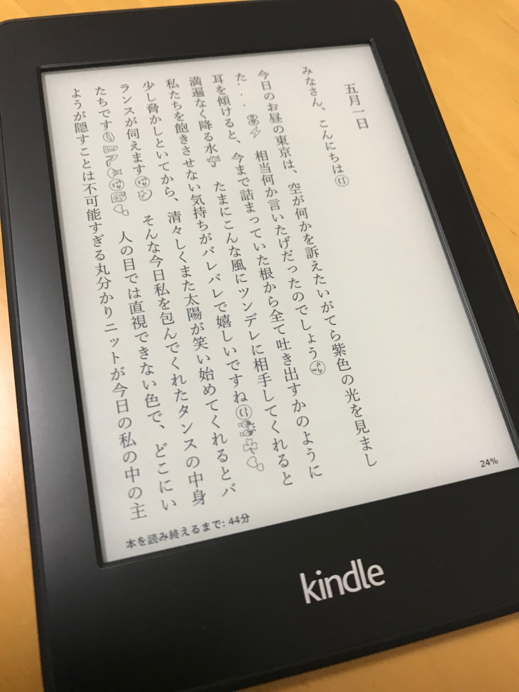

# takizawakarenofficial.mobi

## 概要

滝沢カレンの Instagram の文章を電子書籍化した。
目標は Kindle Paperwhite で縦書き、明朝体、絵文字に対応。

## 使用

Instagram Scraper  
https://github.com/rarcega/instagram-scraper

Re:VIEW (4.0.0)  
https://github.com/kmuto/review

KindleGen  
https://www.amazon.com/gp/feature.html?ie=UTF8&docId=1000765211

Twitter Emoji  
https://github.com/twitter/twemoji

Kindle Paperwhite (Kindle 5.12.2)

## 流れ

    Instagram
      |
      | scrape.sh (Instagram Scraper) ※1
      v
    takizawakarenofficial.json
      |
      | i2r.rb ※2
      v
    catalog.yml, *.re
      |
      | gen_mobi.sh (Re:VIEW, KindleGen) ※3
      v
    takizawakarenofficial.mobi ※4
      |
      |  TwitterColorEmoji-SVGinOT.ttf ※5
      |           |
      | USB cable | 
      v           v
    Kindle Paperwhite

※1 負荷かけないようにウエイト入れるなりする。

※2 ZWJ 絵文字がうまく表示されなかったので、一文字目だけにしている。

※3 css はでんでんコンバーターのものを使用。  
https://conv.denshochan.com/

※4 Send-to-Kindle だとうまくいかなかったので（横書きになってしまう）、直接送った。

※5 fonts フォルダに置いてメニューから選択。これで絵文字は表示されるが、どうしてもゴシック体になってしまう。明朝体にしたかったので、実際は fontmerger を使って游明朝とマージした ttf を使っている。
https://github.com/inaniwa3/fontmerger/tree/twemoji
